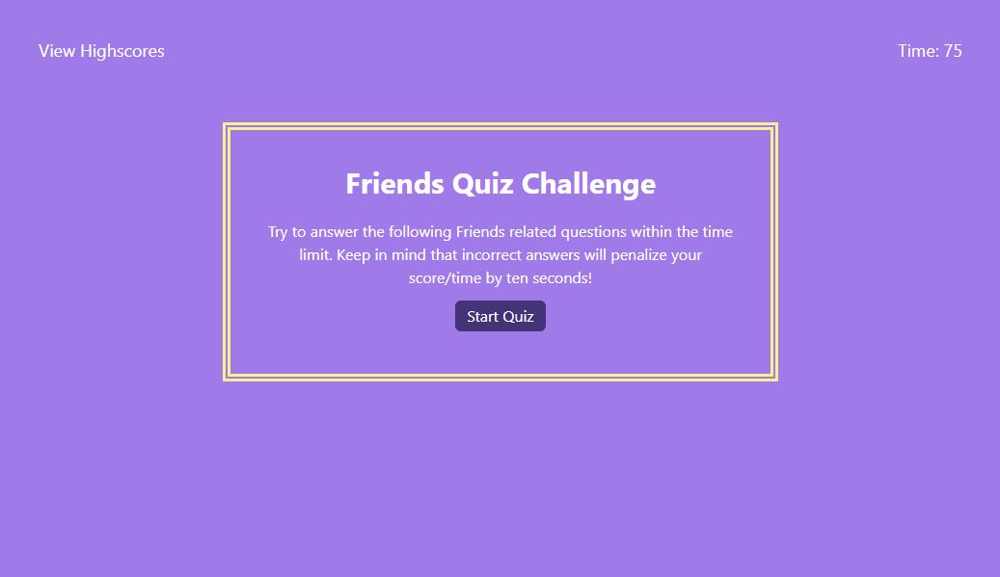

# Code-Quiz

## Description
The aim of this project is creating code for a timed Friends Quiz with multiple-choice questions using **JavaScript**. 

By maintaining this deployed webpage, I aim to present a comprehensive overview of my work and make it easy for others to connect with me.

This application operates within the browser environment, with HTML dynamically updated using **jQuery**. Styling has been implemented using **Tailwind**.

## Usage
A dataset is composed of an **array** with questions and answers. For each question only one answer is correct.

I am using an even listener on a button to start the quiz and the timer.
If the user choose a correct answer, the game will show another question.
If the user choose an incorrect answer, 10 seconds are substracted from the clock.
The quiz is over when all questions are answered or the timer reaches 0.
When the quiz is over, the user can enter their initials. After clicking on 'Submit' button, the user will see all the highscores.
I am using local storage to store all user's initials and scores.
After clicking on 'Clear Highscores' button, local storage is cleared.

After opening the code in the browser the resulting analysis looks as following:

The [URL](https://paulinasiwko.github.io/Code-Quiz/) of deployed application.

## Technologies Used

-  
- 
- 
- 
- 

## Credits
Use of localStorage for highscores was inspired by [this tutorial](https://www.youtube.com/watch?v=DFhmNLKwwGw&ab_channel=JamesQQuick).
